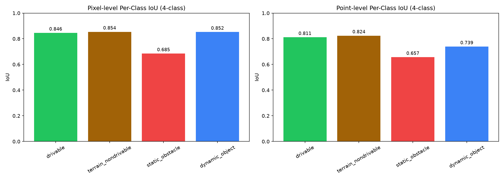
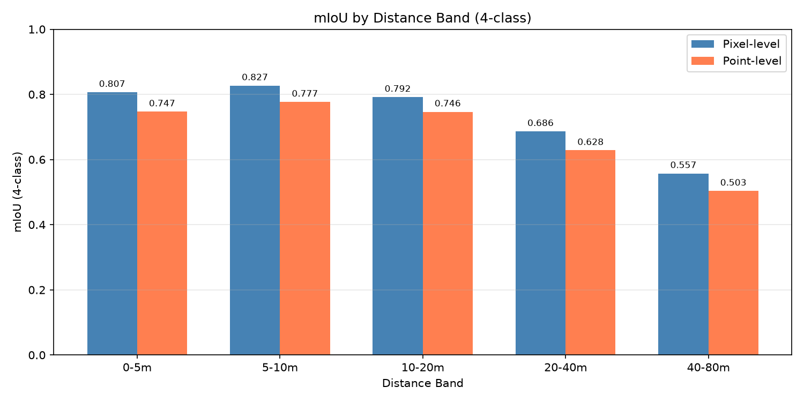
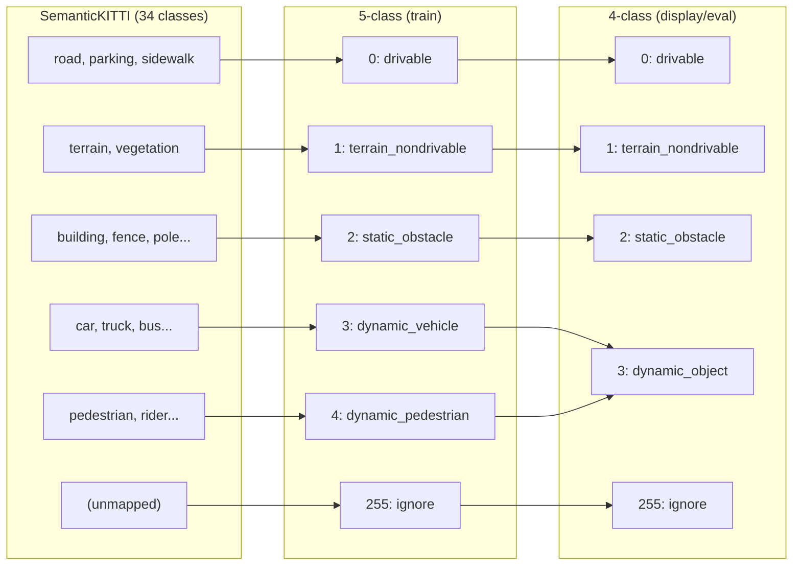

# Adaptive Variable Resolution 2.5D LiDAR Mapping

[](https://www.python.org/)
[](https://pytorch.org/)
[](https://nextjs.org/)
[](#testing)

Real-time semantic segmentation of LiDAR point clouds projected onto a **variable-resolution log-polar 2.5D grid**, streamed over binary WebSocket to an interactive 3D dashboard. Built on SemanticKITTI, powered by a range-image UNet.


---

## Results

### Pixel-level segmentation

| | GPU (RTX 3060 Ti, fp16) | CPU (i5-11400F, fp32) |
|---|:---:|:---:|
| **mIoU 4-class** | **84.7%** | **82.6%** |
| **mIoU 5-class** | 68.4% | 66.6% |
| Latency | ~9 ms/batch | ~442 ms/batch |
| Throughput | ~110 Hz | ~2.3 Hz |

### Point-level segmentation

| | GPU (RTX 3060 Ti, fp16) | CPU (i5-11400F, fp32) |
|---|:---:|:---:|
| **mIoU 4-class** | **65.3%** | **65.3%** |
| **mIoU 5-class** | 52.6% | 52.6% |
| Latency | ~25 ms/scan | ~243 ms/scan |
| Throughput | ~40 Hz | ~4.1 Hz |

### Per-class IoU (4-class, GPU)

| Class | Pixel | Point |
|-------|:-----:|:-----:|
| Drivable | 90.0% | 89.0% |
| Terrain / Non-drivable | 88.6% | 85.7% |
| Static Obstacle | 70.1% | 46.4% |
| Dynamic Object | 89.9% | 40.2% |

### Per-distance-band mIoU (4-class, GPU pixel-level)

| Band | mIoU | Note |
|------|:----:|------|
| 0-5 m | 80.9% | Near-field - 5 cm cells |
| 5-10 m | 85.3% | |
| 10-20 m | 83.8% | |
| 20-40 m | 72.2% | |
| 40-80 m | 58.2% | Far-field - ~50 cm cells |

<details>
<summary>Evaluation plots</summary>






</details>

### Memory: ~7,200× compression

| Grid type | Cell size | Cell count | Memory |
|-----------|-----------|------------|--------|
| Uniform 5 cm | 0.05 m × 0.05 m | ~16 million | ~1,600 MB |
| **Log-polar (ours)** | 5 cm → 50 cm | ~720K | **~220 KB** |

### Test hardware

| | GPU Bench | CPU Bench |
|---|---|---|
| **CPU** | Intel i5-11400F @ 2.60 GHz | Same |
| **GPU** | NVIDIA RTX 3060 Ti (8 GB VRAM) | - |
| **RAM** | 16 GB DDR4 | Same |
| **OS** | Windows 11 | Same |
| **Python** | 3.14 | Same |
| **PyTorch** | 2.11.0+cu128 | Same |


## Quick Start

```bash
# 1. Clone and install
git clone https://github.com/isometric-iitm/LiDAR-Mapping.git
cd LiDAR-Mapping/pc2d
uv sync

# 2. Download the trained checkpoint (~149 MB)
uv run python scripts/download_checkpoint.py

# 3. Set your data path (SemanticKITTI sequence 08)
cp .env.example .env
# Edit .env: PC2D_SEQ_DIR=F:/sih/dataset/sequences/08

# 4. Launch the backend (Terminal 1)
uv run python -m uvicorn src.server.app:create_app --factory --host 127.0.0.1 --port 8000

# 5. Launch the dashboard (Terminal 2)
cd dashboard
npm run dev
```

Open **http://localhost:3000** for the real-time dashboard (Training: **/training**, Evaluation: **/eval**). API docs are at **http://127.0.0.1:8000/docs**.

**No GPU?** Force CPU inference in the backend terminal before starting it:
```powershell
# PowerShell
$env:PC2D_DEVICE="cpu"; $env:PC2D_PRECISION="fp32"; $env:PC2D_PLAYBACK_SPEED="0.5"
```
Then run the backend `uvicorn` command from step 4.

---

## Architecture


### Pipeline stages

| Stage | What | GPU path | CPU path |
|-------|------|----------|----------|
| Projection | Points → (row, col, range) | `project_points_gpu` (all torch on-device) | `compute_projection` (numpy) |
| Range image | Scatter into 5×64×2048 tensor | `build_range_image_gpu` (nearest-wins dedup) | `build_range_image` (far-wins overwrite) |
| Segmentation | UNet forward pass | fp16 autocast + `torch.compile` | fp32, no compile |
| Back-projection | Pixel logits → per-point probs | `_knn_probs` (3×3 gather) | same (tensor ops) |
| Grid update | Per-point labels → 2.5D cells | numpy vectorized `reduceat` + `bincount` | same |
| Streaming | Grid cells → binary frames | `ws_protocol` (44-byte header, 28-byte rows) | same |

---

## Project Structure

```
pc2d/
├── config/                   # YAML configs (env overrides via PC2D_* vars)
│   ├── pipeline.yaml         #   live streaming pipeline
│   ├── train_range_image.yaml#   training / preprocessing
│   ├── grid.yaml             #   log-polar grid geometry + decay
│   └── classes.yaml          #   semantic_kitti_5class + bin_5_to_4 mapping
├── src/
│   ├── common/config.py      # load_config, resolve_path, resolve_device/precision
│   ├── data/
│   │   ├── projection.py     # CPU + GPU spherical projection, range-image build
│   │   ├── label_mapping.py  # remap_labels, bin_5_to_4, compute_class_weights
│   │   ├── augmentation.py   # flip-H, intensity jitter, cutout
│   │   ├── webdataset_loader.py  # tar-shard IterableDataset + DataLoader
│   │   └── replayer.py       # wall-clock-paced SemanticKITTI sequence reader
│   ├── models/
│   │   ├── unet.py           # RangeImageUNet (5-level encoder-decoder)
│   │   ├── lovasz.py         # CombinedLoss (CE + Lovasz-Softmax)
│   │   └── predict.py        # Segmenter (end-to-end: project → forward → KNN)
│   ├── grid_engine/
│   │   └── logpolar_grid.py  # LogPolarGrid (~720K cells, ~220 KB, decay, delta)
│   └── server/
│       ├── app.py            # FastAPI + Pipeline thread + WS endpoints
│       └── ws_protocol.py    # Binary framing (magic 0x50433244)
├── eval/
│   ├── run_evaluation.py     # pixel + point mIoU, per-distance-band, latency
│   └── inject_results.py     # auto-inject eval results into this README
├── scripts/
│   ├── train.py              # train the UNet on precomputed shards
│   ├── preprocess_to_shards.py  # raw .bin → tar shards (ri + li)
│   ├── download_checkpoint.py# fetch best_miou.pt from GitHub Release
│   └── export_onnx.py        # export UNet to ONNX (opset 17)
├── tests/                    # 96 tests (see Testing section)
├── results/                  # eval outputs (JSON, PNG, MD)
├── checkpoints/              # best_miou.pt (gitignored), history.jsonl
├── dashboard/                # Next.js 16 real-time dashboard (see dashboard/README.md)
└── .env.example              # documents all PC2D_* environment variables
```

---

## Variable-Resolution Grid

The core innovation: ring width grows geometrically from **5 cm (near)** to **~50 cm (far)**, achieving dramatic memory savings while preserving fine detail where it matters most.

### Ring geometry

| Parameter | Value | Description |
|-----------|-------|-------------|
| `dr_0` | 0.05 m | First ring width (5 cm) |
| `alpha` | 1.05 | Geometric growth factor per ring |
| `r_min` | 0.5 m | Inner dead zone |
| `r_max` | 100 m | Outer cutoff |
| `n_theta` | 720 | Angular sectors (0.5° each) |
| Resulting rings | ~1,000 | dr_0 * α^i reaches r_max at i≈997 |
| Resulting cells | ~720K | rings × sectors |

### Temporal dynamics

| Feature | Mechanism | Parameter |
|---------|-----------|-----------|
| Occupancy decay | `occ *= exp(-dt / tau_free)` | `tau_free = 1.5 s` |
| Occupancy gain | `occ += (1 - occ) * gain` on hit | `gain = 0.3` |
| Rendered threshold | `occ > 0.2` | - |
| Dynamic detection | free→occupied flip boosts `dyn_score` | `dyn_change_boost = 0.2` |
| Dynamic threshold | `dyn_score > 0.5` | - |
| Ground reference | 20th percentile of z in 1.5-15 m | auto-tracked per frame |

---

## Label Mapping



Training uses 5-class with inverse-sqrt-frequency class weights. Grid display and evaluation use the binned 4-class scheme (merging vehicle + pedestrian → dynamic_object).

---

## Configuration

All paths and model parameters come from **config YAML + environment overrides**. No hardcoded absolute paths.

### Precedence (highest wins)

```
CLI flag  >  PC2D_* env var  >  config YAML  >  default
```

### Environment variables

| Variable | Config target | Type | Description |
|----------|--------------|------|-------------|
| `PC2D_SEQ_DIR` | `source.seq_dir` | path | Raw SemanticKITTI sequence directory |
| `PC2D_CHECKPOINT` | `model.checkpoint` | path | Trained model checkpoint (.pt) |
| `PC2D_CKPT_DIR` | `server.ckpt_dir`, `checkpoint.dir` | path | Checkpoint + history directory |
| `PC2D_DEVICE` | `model.device` | `auto\|cuda\|cpu` | Compute device |
| `PC2D_PRECISION` | `model.precision` | `fp32\|fp16` | Model precision |
| `PC2D_PLAYBACK_SPEED` | `source.playback_speed` | float | Playback speed multiplier |
| `PC2D_RAW_ROOT` | `data.raw_root` | path | Root of raw sequences |
| `PC2D_PROCESSED_ROOT` | `data.processed_root` | path | Root of preprocessed shards |

All optional. Unset vars fall back to relative defaults in YAML, resolved against the `pc2d/` repo root. Copy `.env.example` to `.env` for your machine.

---

## Device & Precision

| Device | Precision | Behavior |
|--------|-----------|----------|
| `auto` | - | Resolves to CUDA if available, else CPU |
| `cuda` | `fp16` | Model `.half()`, AMP autocast, `torch.compile`, GradScaler |
| `cuda` | `fp32` | Full precision, no AMP, no compile |
| `cpu` | any | No `.half()`, no AMP, no GradScaler, no compile |

---

## Evaluation

```bash
# Full eval (pixel + point level) on GPU
uv run python eval/run_evaluation.py --device cuda

# CPU-only eval
uv run python eval/run_evaluation.py --device cpu

# Pixel-level only (uses preprocessed shards)
uv run python eval/run_evaluation.py --pixel-only --limit 100

# Point-level only (uses raw .bin + .label files)
uv run python eval/run_evaluation.py --point-only --seq-dir /path/to/sequences/08

# Inject latest results into README
uv run python eval/inject_results.py
```

Outputs written to `results/`:

| File | Description |
|------|-------------|
| `eval_{timestamp}.json` | Full results (confusion matrices, per-class IoU, per-distance-band) |
| `confusion_matrices.png` | Row-normalized 5-class and 4-class confusion matrices |
| `per_class_iou.png` | Per-class IoU bar chart |
| `per_distance_band.png` | mIoU by distance band (pixel + point) |
| `eval_summary.md` | Human-readable Markdown summary |

---

## Scripts Reference

| Script | Purpose | Key args |
|--------|---------|----------|
| `scripts/train.py` | Train RangeImageUNet | `--config`, `--resume`, `--device`, `--precision`, `--processed-root` |
| `scripts/preprocess_to_shards.py` | Raw .bin → tar shards | `--raw-root`, `--processed-root`, `--train-seqs`, `--val-seqs`, `--force` |
| `scripts/download_checkpoint.py` | Fetch best_miou.pt from Release | `--url`, `--out`, `--force` |
| `scripts/export_onnx.py` | Export UNet to ONNX | `--checkpoint`, `--out`, `--opset 17` |
| `eval/run_evaluation.py` | Full eval harness | `--device`, `--precision`, `--pixel-only`, `--point-only`, `--limit` |
| `eval/inject_results.py` | Inject eval into README | (reads `results/`, writes `README.md`) |

---

## WebSocket Protocol

Real-time data uses a compact binary framing protocol (40-100× smaller than JSON):

### Header (44 bytes)

| Field | Type | Description |
|-------|------|-------------|
| `magic` | uint32 | `0x50433244` ("PC2D") |
| `code` | uint16 | 1=snapshot, 2=delta, 3=cloud |
| `version` | uint16 | 1 |
| `frame` | uint64 | Grid frame counter |
| `epoch` | uint64 | Bumped on seek (stale-frame filter) |
| `n_a` | int32 | Active/updated rows |
| `n_b` | int32 | Freed rows (delta only) |
| `seq` | int32 | Chunk sequence index |
| `total` | int32 | Total chunks in this frame |
| `yaw_cd` | int32 | Ego yaw in centi-degrees |

### Body

| Message | Layout |
|---------|--------|
| Snapshot | `n_a` × 28 bytes (i, j, z_mean, z_max, occ, dyn as float32 + cls as uint8 + 3 pad) |
| Delta | same + `n_b` × 8 bytes (freed i, j as float32) |
| Cloud | `n_a` × 12 bytes (x, y, z as float32) + `n_a` × uint8 (cls) |

Large frames split at 8,000 cells / 30,000 cloud points. The epoch field lets the client discard in-flight stale data after a seek.

---

## Testing

```bash
uv run pytest
```

102 tests across 10 files, zero dependency on external data paths:

| Test file | Tests | Coverage |
|-----------|-------|----------|
| `test_grid_geometry.py` | 18 | Ring/sector indexing, cell counts, memory report, round-trip xy→cell |
| `test_projection.py` | 7 | CPU/GPU parity, nearest-wins, KNN back-projection, edge cases |
| `test_label_mapping.py` | 8 | remap_labels, bin_5_to_4, compute_class_weights |
| `test_grid_update.py` | 5 | Occupancy decay, snapshot/delta invariants, reset |
| `test_ws_protocol.py` | 4 | Binary header magic/codes, 32-byte row layout (v2) |
| `test_segmenter_cpu.py` | 3 | Empty scan, synthetic scan, CPU device |
| `test_e2e_replay.py` | 5 | Replayer seek, pipeline seek-reset + epoch guard |
| `test_evaluation.py` | 25 | Eval helpers, path resolution, synthetic pixel eval, plots, inject |
| `test_traversability.py` | 6 | Flat drivable, steep blocked, class scores, tiers, grid integration |
| `test_harness.py` | 21 | Fixture smoke tests, projection, grid geometry |

---

## Checkpoint Delivery

Model weights are **not committed to git** (149 MB binary). Instead they're delivered via GitHub Release:

```bash
uv run python scripts/download_checkpoint.py
```

This fetches `best_miou.pt` from [v1.0.0](https://github.com/isometric-iitm/LiDAR-Mapping/releases/tag/v1.0.0) (149 MB, mIoU 84.7% 4-class pixel-level on val set). See `checkpoints/README.md` for publishing newer checkpoints.

---

## Dashboard

A Next.js 16 + Three.js real-time 3D dashboard with interactive map, point cloud overlays, playback controls, and training curves. See **[dashboard/README.md](dashboard/README.md)** for full documentation.

| 2.5D Grid | Segmented Cloud | Compare (Grid + Raw Cloud) |
|-----------|-----------------|----------------------------|
|  |  |  |

*Full animated demo at the top of this README.*

---

## Credits

- **Dataset**: [SemanticKITTI](http://semantic-kitti.org/) - Geiger et al., IV 2012 / Behley et al., ICCV 2019
- **Framework**: [PyTorch](https://pytorch.org/), [FastAPI](https://fastapi.tiangolo.com/), [Next.js](https://nextjs.org/), [Three.js](https://threejs.org/)
- **Loss**: Lovasz-Softmax - Berman et al., CVPR 2018
