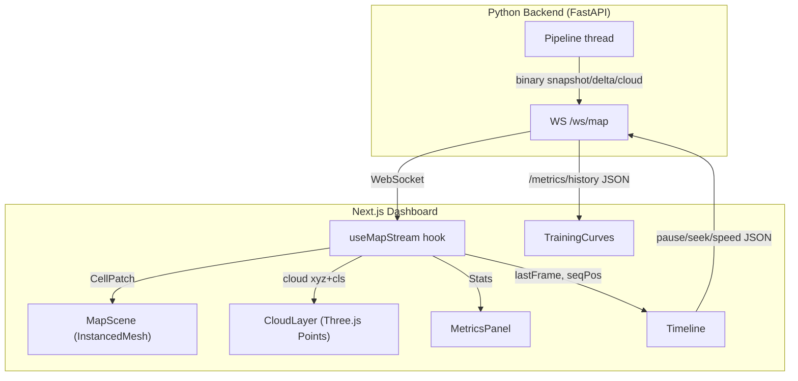

# PC2D Dashboard

[](https://nextjs.org/)
[](https://react.dev/)
[](https://threejs.org/)
[](https://www.typescriptlang.org/)

Real-time 3D semantic map viewer and training curves for the PC2D LiDAR mapping pipeline. Streams binary grid updates over WebSocket from the Python backend and renders them as an interactive instanced-mesh 3D scene.


| Grid 2.5D | Segmented Cloud | Compare |
|-----------|-----------------|---------|
|  |  |  |

---

## Features

- **2.5D log-polar grid** - ~469K cells rendered as instanced boxes, incrementally updated via delta patches (only changed cells re-computed)
- **Segmented point cloud** - class-colored per-point overlay from the UNet's KNN back-projection
- **Raw point cloud comparison** - height-gradient colored overlay for side-by-side inspection
- **Compare mode** - segmented and raw clouds overlaid simultaneously
- **Playback controls** - pause, seek, speed (0.5x-5x), with heading-up camera convention
- **Live metrics** - FPS, per-stage latency (segment / project / forward / grid / pack / cloud), memory
- **Memory comparison** - side-by-side bars: log-polar grid (~220 KB) vs uniform 5 cm grid (~1.6 GB)
- **Cell hover inspection** - class, height, occupancy %, dynamic score, range, bearing
- **Training curves** - mIoU (4-class, 5-class), validation loss, per-class IoU over training steps
- **Evaluation** - pixel + point level mIoU, per-class IoU, per-distance-band mIoU, latency, memory
- **Iconoir icons** - Play/Pause, compass (north-up), and page navigation use the [Iconoir](https://iconoir.com/) icon set
- **~34x memory compression** visualization in the sidebar

---

## Pages

| Route | Page | Description |
|-------|------|-------------|
| `/` | Live Map | Real-time 3D grid + cloud viewer with sidebar and timeline |
| `/training` | Training Curves | Loss and mIoU charts from `history.jsonl` |
| `/eval` | Evaluation | Pixel + point eval metrics from the backend `/metrics/eval` API |

---

## Component Reference

| Component | File | Description |
|-----------|------|-------------|
| `MapScene` | `src/components/MapScene.tsx` | Three.js 3D scene: instanced grid cells (`InstancedCells`), point clouds (`CloudLayer`), ego marker, range rings, ground plane, `FramePerf` telemetry |
| `Timeline` | `src/components/Timeline.tsx` | Playback bar: play/pause, scrub/seek, speed selector (0.5x-5x), frame counter |
| `MetricsPanel` | `src/components/MetricsPanel.tsx` | Sidebar: stats grid, memory bars, view-mode selector, cell hover info, Training / Evaluation links |
| `TrainingCurves` | `src/components/TrainingCurves.tsx` | Recharts: mIoU + val loss dual-axis chart, per-class IoU chart, metric cards |
| `EvalPanel` | `src/components/EvalPanel.tsx` | Recharts: pixel/point mIoU, per-class IoU bars, distance-band mIoU, latency + memory |

---

## Data Flow



### Message types (server -> client)

| Type | Format | When |
|------|--------|------|
| `grid_meta` | JSON | Once on connect (ring geometry, class colors) |
| Snapshot | Binary (code=1) | Every 5 frames - full rendered cell list |
| Delta | Binary (code=2) | Every other frame - only changed + freed cells |
| Cloud | Binary (code=3) | When cloud stream is on - xyz + cls arrays |
| `stats` | JSON | Every 2 frames - FPS, latency, memory |
| `control_ack` | JSON | Response to pause/play/seek/speed commands |

### Control messages (client -> server)

```json
{"type": "control", "action": "pause"}
{"type": "control", "action": "play"}
{"type": "control", "action": "speed", "value": 2.0}
{"type": "control", "action": "seek", "value": 150}
{"type": "control", "action": "cloud", "value": true}
{"type": "request_snapshot"}
```

---

## WebSocket Hook: `useMapStream`

The central data layer (`src/lib/useMapStream.ts`). Manages the WebSocket connection, decodes binary and JSON messages, and exposes reactive state.

| Return field | Type | Description |
|--------------|------|-------------|
| `conn` | `"connecting" \| "open" \| "closed"` | Connection state |
| `meta` | `GridMeta \| null` | Grid geometry (received once) |
| `cells` | `CellMap` | Full cell map (`Map<string, Cell>`) |
| `patch` | `CellPatch \| null` | Latest incremental patch (reset / delta / snap) |
| `stats` | `Stats \| null` | Latest performance metrics |
| `cloud` | `{frame, xyz, cls} \| null` | Latest point cloud data |
| `cloudOn` | `boolean` | Whether cloud streaming is active |
| `setCloudOn` | `(on: boolean) => void` | Toggle cloud stream |
| `seeking` | `boolean` | Whether a seek is in progress |
| `seekTo` | `(idx: number) => void` | Seek to a frame index |
| `send` | `(msg: object) => void` | Send JSON to the server |

Key behaviors:
- **Auto-reconnect** on disconnect (2-second delay)
- **Binary decoding** - zero-copy `Float32Array` / `Uint8Array` views, no `ArrayBuffer.slice()`
- **Delta accumulation** - cells across chunks are buffered, committed to React state only on final chunk
- **Epoch guard** - after a seek, frames with mismatched epoch are discarded
- **Freeze-on-pause** - when paused, frames newer than the freeze-frame are dropped

---

## Types

All shared types live in `src/lib/types.ts`:

| Type | Description |
|------|-------------|
| `Cell` | `[i, j, zMean, zMax, cls, occ, dyn]` - single grid cell tuple |
| `GridMeta` | Grid config: `r_min`, `r_max`, `r_transition`, `alpha`, `dr_0`, `n_rings`, `phase1_rings`, `n_theta`, `n_classes`, `class_colors` |
| `Stats` | Performance: `frame`, `fps`, latency p50/p95, per-stage ms, memory, compression ratio |
| `SnapshotMsg` | Full grid: `frame`, `seq`, `total`, `cells[]`, optional `epoch` |
| `DeltaMsg` | Incremental: `frame`, `seq`, `total`, `cells[]`, `freed[]`, optional `epoch` |
| `CloudMsg` | Point cloud: `frame`, `n`, `xyz[]` (flat Float32), `cls[]` (Uint8), optional `epoch` |
| `ServerMsg` | Union of all above - discriminated on `type` field |

---

## Setup & Run

### Standalone

```bash
cd dashboard
npm install
npm run dev
```

Open http://localhost:3000 (requires the Python backend running on port 8000).

### With the backend (recommended)

Run the backend and dashboard in two separate terminals so each one's logs are visible.

**Terminal 1 - backend**, from `pc2d/` root:
```bash
uv run python -m uvicorn src.server.app:create_app --factory --host 127.0.0.1 --port 8000
```

**Terminal 2 - dashboard**, from `pc2d/dashboard`:
```bash
npm run dev
```

### Production build (static export)

The dashboard is a fully client-side app (`output: "export"` in `next.config.ts`), so `npm run build` emits static HTML/JS/CSS into `out/`. There is no Next.js server, `npm start` previews the exported `out/` folder locally.

```bash
cd dashboard
npm run build   # emits static site to out/
npm start       # local preview of out/ (requires the backend on port 8000)
```

---

## Deploying to Cloudflare Pages

The `out/` static export can be hosted on any static host. For Cloudflare Pages:

| Setting | Value |
|---------|-------|
| Root directory | `dashboard` |
| Build command | `npm run build` |
| Build output directory | `out` |
| Node version | Pinned via `dashboard/.node-version` (22) |

Environment variables (set for **Production and Preview** in the Pages dashboard; `dashboard/.gitignore` excludes `.env*`, so they can't be committed):

| Variable | Example | Notes |
|----------|---------|-------|
| `NEXT_PUBLIC_PC2D_API` | `https://api.example.com` | Must be `https://` (Pages is HTTPS; `http://` gets blocked as mixed content) |
| `NEXT_PUBLIC_PC2D_WS` | `wss://api.example.com/ws/map` | Must be `wss://` |

`NEXT_PUBLIC_*` vars are inlined **at build time**, so changing the backend URL requires a new Pages build (redeploy).

The backend must allow CORS from the Pages origin: `*.pages.dev` deployments (production and preview) are always allowed via regex in `src/server/app.py`; add any custom domain to the backend's `PC2D_CORS_ORIGINS` env var (comma-separated).

---

## Environment Variables

| Variable | Default | Description |
|----------|---------|-------------|
| `NEXT_PUBLIC_PC2D_WS` | `ws://localhost:8000/ws/map` | WebSocket URL for the map stream |
| `NEXT_PUBLIC_PC2D_API` | `http://localhost:8000` | HTTP API base URL (for training history) |

Set these in `dashboard/.env.local` if the backend runs on a different host/port. They are inlined at build time (`next build`), not read at runtime. See the Cloudflare Pages section above for hosted deployments.

---

## Tech Stack

| Technology | Version | Purpose |
|------------|---------|---------|
| [Next.js](https://nextjs.org/) | 16.3 | App Router, static export, bundling |
| [React](https://react.dev/) | 19.2 | UI framework |
| [Three.js](https://threejs.org/) | 0.185 | 3D rendering engine |
| [@react-three/fiber](https://docs.pmnd.rs/react-three-fiber) | 9.7 | React renderer for Three.js |
| [@react-three/drei](https://docs.pmnd.rs/drei) | 10.7 | Helpers (OrbitControls, etc.) |
| [Recharts](https://recharts.org/) | 3.10 | Training curve charts |
| [Tailwind CSS](https://tailwindcss.com/) | 4 | Utility-first styling |
| [TypeScript](https://www.typescriptlang.org/) | 5 | Type safety |

---

## View Modes

| Mode | Key | Renders | Use case |
|------|-----|---------|----------|
| Grid 2.5D | `grid` | Instanced boxes colored by class x occupancy | Overview of the full semantic map |
| Seg cloud | `seg` | Class-colored point cloud (Three.js Points) | Inspect per-point segmentation quality |
| Raw cloud | `raw` | Height-gradient colored point cloud | Inspect raw geometry |
| Compare | `compare` | Segmented + raw overlaid | Side-by-side segmentation quality |


